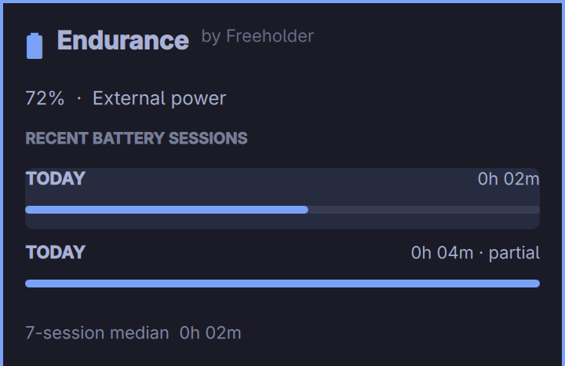

# Endurance

**Endurance tells you how long your laptop actually lasts on each charge — and helps explain where the battery went.**

A small Omarchy bar widget opens a native panel led by recent battery sessions:



Select a session to see its observed start and reconnect times, percentage drop, wall and awake duration, discharge curve, Wh consumed where available, a clearly normalised 100→0 equivalent, and an experimental CPU activity breakdown. It works with partial charges; no 100% starting point is needed.

## Status

The recorder passed a fully observed 120-second unplug/replug cycle on the development Dell. The session was persisted with its start/end percentage and a two-minute median. Ten automated tests cover partial charges, reconnects, suspend gaps, reboot interruption, stale observations, migration and database corruption. Fresh install, update and removal were exercised with the public Git URL on Omarchy 4.0.4. A real suspend/resume cycle has not been exercised; suspend handling is covered by simulated clock tests.

## Requirements and local development

Omarchy Quattro (tested against the 4.0.4 manifest contract) and Python 3 with its standard library. No account, network service, daemon install or privilege escalation.

```bash
omarchy plugin validate .
python3 -m unittest discover -s tests
```

For a development install, place this repository at `~/.config/omarchy/plugins/freeholder.endurance`, then run:

```bash
omarchy plugin enable freeholder.endurance
```

Install with:

```bash
omarchy plugin add https://github.com/freeholder-dev/endurance.git --enable
```

The installed Omarchy 4.0.4 CLI documents `plugin add [git-url] [--enable]` and the [current plugin guide](https://plugins.omarchy.org/develop.html) uses the same mechanism.

## Using it

Click the bar widget. Use arrow keys to choose a session, Enter to open it, and Escape to return or close. The chart compares observed wall durations; interrupted and first-observed sessions are labelled so they are not mistaken for fully witnessed discharge cycles. The median uses up to seven latest complete, observed unplug-to-reconnect sessions.

The recorder samples once per minute even when the panel is closed. Leaving the Omarchy shell running is necessary to catch power transitions. Shell restarts preserve an open session; a reboot closes it as interrupted at the last sample.

## Data and privacy

History is local at `${XDG_STATE_HOME:-~/.local/state}/endurance/history.sqlite3`. The database stores battery sessions, percentage and energy samples, and process names with CPU tick totals. It contains no command lines, file names, account data or network traffic. Endurance has no cloud or telemetry endpoint. `omarchy plugin remove freeholder.endurance` removes the plugin; delete the state directory yourself if you also want to erase history.

## Measurement and limits

- Battery percentage and time are read from the kernel. Direct `energy_now` is measured where the battery exposes it. On hardware like this Dell, Wh is approximated from charge × instantaneous voltage.
- Suspend is estimated from the difference between Linux boottime and monotonic clocks at successive samples. A transition while asleep is timestamped at the first observation after resume.
- The equivalent 100→0 figure scales one session's wall duration by its percentage drop; it is a normalised comparison, not a runtime forecast.
- **CPU activity proxy · experimental** is each process name's share of observed CPU ticks. It is not a measured battery-energy percentage. GPU, screen, memory, I/O, idle power and short-lived processes are not reliably attributed. See [architecture and attribution](docs/ARCHITECTURE.md).
- A shell that is not running cannot record a complete power cycle. A first observation on battery is labelled as such. No remaining-time estimate is shown until a stable, defensible model exists.

## Update and removal

Once installed from Git, use `omarchy plugin update freeholder.endurance`. Remove with `omarchy plugin remove freeholder.endurance`. Neither command deletes the local SQLite history.

## License

MIT. Endurance by Freeholder.
